<div align="center">


# brain.md

**A local-first second brain for you — and for your AI agents.**

[](LICENSE)
[](https://bun.com)
[](docs/mcp.md)
[](#-semantic-search-rag)
[](https://glama.ai/mcp/servers/mi4uu/brain.md)
[](https://smithery.ai/server/mi4uu/brain-md)

</div>

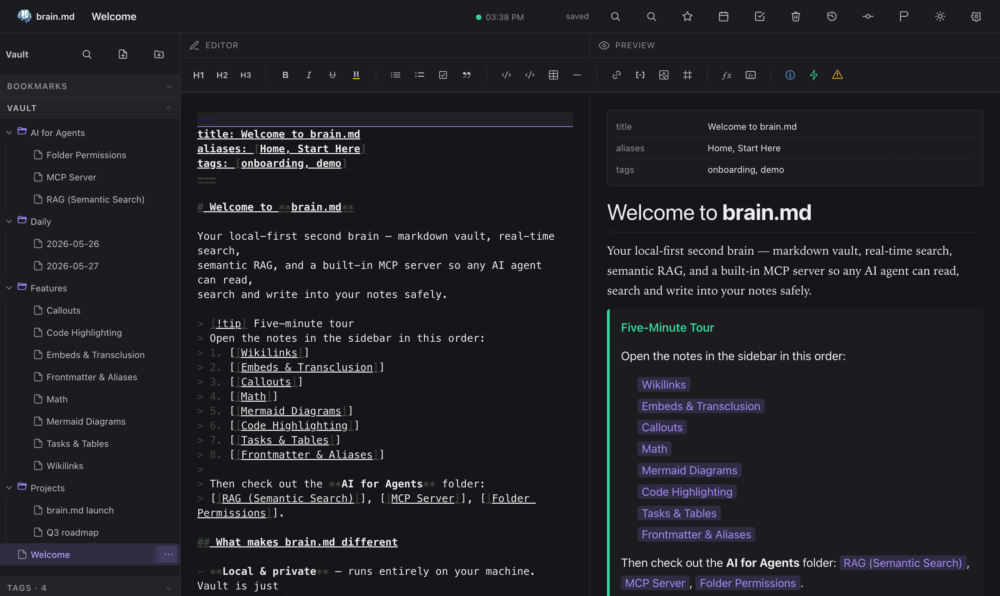

<div align="center">

### What you get

</div>

| | |
|---|---|
| 📝 &nbsp; **Obsidian-compatible markdown** | Wikilinks, embeds, callouts, math, mermaid, tasks, frontmatter, aliases. Open your existing Obsidian vault — it just works. |
| ⚡ &nbsp; **Live editor + preview** | CodeMirror 6 with cursor-anchored scroll sync, autosave, instant tooltips, command palette, quick switcher. |
| 🔍 &nbsp; **Semantic search built in** | Per-vault embedded vector store (pure JS, no external DB). Notes are chunked, embedded and indexed on every save. |
| 🤖 &nbsp; **Pluggable embedders** | Default: `bge-small-en-v1.5` running locally via **bundled WASM ONNX** — works in the prebuilt single binary, zero native deps. Or point at **Ollama**, **LM Studio**, **OpenAI** — anything with `/v1/embeddings`. |
| 🛰️ &nbsp; **MCP server (streamable HTTP)** | 17 tools + 2 resources mounted on the same port. Claude Desktop, Claude Code, Cursor and any MCP-compliant agent can read, search, query and write your notes. |
| 🔒 &nbsp; **Per-folder agent permissions** | Right-click a folder → set `{read, write}` for the MCP surface. Keep `Journal/Private/` out of agent reach without locking down the vault. |
| 🔑 &nbsp; **Optional password auth** | argon2id, bearer tokens, 24-hour TTL — gates both HTTP API and MCP. Off by default, on with one click. |
| 📜 &nbsp; **Git autocommit** | Every save lands in git. Full history, diff, restore, manual checkpoints. The vault is a real git repo on disk. |
| 🌍 &nbsp; **No vendor lock-in** | Your vault is a folder of `.md` files. Open it in VSCode, Obsidian, `cat`, anything. brain.md is just one more way to view and query it. |
| 💸 &nbsp; **Zero API keys required** | Out of the box it runs fully offline. Cloud embedders are an opt-in, not a default. |

---

## Why brain.md

LLMs are only as smart as the context you give them. **brain.md** turns
your notes into that context — without dragging them into someone
else's cloud, without locking them inside a proprietary format, and
without asking you to plumb a vector database yourself.

You write markdown. brain.md gives you:

- a polished **editor + live preview** with the full
  Obsidian-flavor dialect (wikilinks, embeds, callouts, math, mermaid,
  highlights, tasks, frontmatter, aliases),
- a per-vault embedded vector store (pure JS, ships in the single
  binary) with a local `bge-small-en-v1.5` embedder by default
  running via bundled WASM ONNX — switch to **Ollama**,
  **LM Studio**, **OpenAI**, or anything else with a `/v1/embeddings`
  endpoint with one toggle,
- an **MCP server** (streamable HTTP) mounted on the same port, so
  Claude Desktop (or any MCP client) can read, search and write your
  notes safely — with **per-folder read/write permissions** for the
  agent surface,
- optional **password auth** and **git autocommit / restore** for the
  whole vault.

Everything runs on your machine. The vault is a plain folder of `.md`
files you can open in any editor at any time.

### How it compares

|                                         | Obsidian                | Logseq          | Notion             | **brain.md**           |
|-----------------------------------------|-------------------------|-----------------|--------------------|------------------------|
| License                                 | Proprietary             | AGPL-3.0        | Proprietary        | **AGPL-3.0**           |
| Local-first vault on disk               | ✓                       | ✓               | ✗ (cloud)          | **✓**                  |
| Plain `.md` files (no proprietary db)   | ✓                       | ✓ (block model) | ✗                  | **✓**                  |
| Built-in MCP server                     | ✗ (3rd-party plugin)    | ✗               | ✗                  | **✓ — 17 tools**       |
| Vector RAG built-in                     | ✗ (paid plugin)         | ✗               | ✓ (cloud only)     | **✓ — embedded, local** |
| Per-folder agent permissions            | n/a                     | n/a             | n/a                | **✓**                  |
| Single binary, no Electron              | ✗ (Electron)            | ✗ (Electron)    | n/a                | **✓ — `bun --compile`** |
| Works fully offline (incl. embeddings)  | ✓ (no AI)               | ✓ (no AI)       | ✗                  | **✓ — bundled WASM ONNX** |

brain.md is *not* trying to replace Obsidian's plugin ecosystem or
Notion's databases. It's narrower on purpose: a markdown vault
designed from day one as a memory layer for AI agents over the
Model Context Protocol.

---

## Table of contents

- [Quick start](#-quick-start)
- [Install](#-install)
- [The interface](#-the-interface)
  - [Editor + preview](#editor--preview)
  - [Markdown that actually does things](#markdown-that-actually-does-things)
  - [Command palette + quick switcher](#command-palette--quick-switcher)
  - [Tasks across the vault](#tasks-across-the-vault)
- [AI for agents](#-ai-for-agents)
  - [Semantic search (RAG)](#-semantic-search-rag)
  - [MCP server](#-mcp-server)
  - [Per-folder permissions](#-per-folder-permissions)
  - [Optional password auth](#-optional-password-auth)
- [CLI](#-cli)
- [Defaults & paths](#-defaults--paths)
- [Architecture](#-architecture)
- [Roadmap](#-roadmap)
- [Contributing](#-contributing)
- [License](#-license)

---

## ⚡ Quick start

One line. No clone, no Bun, no Node — the installer detects your OS +
arch, downloads the matching prebuilt binary from the latest GitHub
release, drops it in `~/.local/bin` (or `%USERPROFILE%\.brain.md\bin`
on Windows), and verifies it runs.

### macOS / Linux

```sh
curl -fsSL https://raw.githubusercontent.com/mi4uu/brain.md/main/install.sh | bash
```

### Windows (PowerShell)

```powershell
powershell -c "irm https://raw.githubusercontent.com/mi4uu/brain.md/main/install.ps1 | iex"
```

Then:

```sh
brainmd                  # serve on :3000, vault at $HOME/.local/share/brain.md/vault
open http://localhost:3000
```

Open <http://localhost:3000>. First run creates your vault at the
XDG default (`$HOME/.local/share/brain.md/vault` on macOS / Linux,
the equivalent on Windows).

To enable semantic search and the MCP `similar_notes` tool, open
**Settings → AI / RAG** and flip the switch. Default embedder is
`bge-small-en-v1.5` running locally via bundled WASM ONNX (one-time
~34 MB quantized model download, then fully offline — no Ollama, no
Python, no native deps).

> **Want a tour?** Point brain.md at the demo vault that ships with
> the repo:
> ```sh
> brainmd --vault-dir ./example/vault
> ```
> Every screenshot below was taken against [`example/vault/`](example/).

---

## 📦 Install

### Option A — install script *(recommended, see [Quick start](#-quick-start))*

```sh
# macOS / Linux
curl -fsSL https://raw.githubusercontent.com/mi4uu/brain.md/main/install.sh | bash

# Windows
powershell -c "irm https://raw.githubusercontent.com/mi4uu/brain.md/main/install.ps1 | iex"
```

The script picks the right asset for your OS and CPU, writes it to
`~/.local/bin/brain` (or `%USERPROFILE%\.brain.md\bin\brain.exe`),
chmod's it, and verifies it boots. Pin a version with
`BRAIN_VERSION=v0.1.0`, change the install dir with `BRAIN_INSTALL=…`.

### Option B — download the binary manually

Every release ships a **single-file executable** per platform with
the web UI embedded inside it. No Bun runtime, no Node.js, no
`git clone`, no `bun install` — just download, mark executable, run.

Grab the file for your machine from the latest release:
👉 **[github.com/mi4uu/brain.md/releases/latest](https://github.com/mi4uu/brain.md/releases/latest)**

| Platform                          | Architecture | Asset                                                                                                          |
|-----------------------------------|--------------|----------------------------------------------------------------------------------------------------------------|
| 🍎 &nbsp; macOS — Apple Silicon  | `arm64`      | [`brain-md-darwin-arm64`](https://github.com/mi4uu/brain.md/releases/latest/download/brain-md-darwin-arm64)    |
| 🍎 &nbsp; macOS — Intel          | `x64`        | [`brain-md-darwin-x64`](https://github.com/mi4uu/brain.md/releases/latest/download/brain-md-darwin-x64)        |
| 🐧 &nbsp; Linux                   | `x64`        | [`brain-md-linux-x64`](https://github.com/mi4uu/brain.md/releases/latest/download/brain-md-linux-x64)          |
| 🐧 &nbsp; Linux                   | `arm64`      | [`brain-md-linux-arm64`](https://github.com/mi4uu/brain.md/releases/latest/download/brain-md-linux-arm64)      |
| 🪟 &nbsp; Windows                  | `x64`        | [`brain-md-windows-x64.exe`](https://github.com/mi4uu/brain.md/releases/latest/download/brain-md-windows-x64.exe) |

#### One-liner — macOS / Linux

```sh
# macOS Apple Silicon — swap the URL suffix for your platform from the table above
curl -L -o brainmd \
  https://github.com/mi4uu/brain.md/releases/latest/download/brain-md-darwin-arm64
chmod +x brainmd
./brainmd                                # → serves on http://localhost:3000
```

```sh
# Optional: drop it on your $PATH so you can run `brainmd` anywhere
sudo mv brainmd /usr/local/bin/brainmd
brainmd --help                           # see all flags
brainmd --port 4000                      # custom port
brainmd --vault-dir ~/notes/my-vault     # custom vault location
```

#### One-liner — Windows (PowerShell)

```powershell
iwr https://github.com/mi4uu/brain.md/releases/latest/download/brain-md-windows-x64.exe `
    -OutFile brainmd.exe
.\brainmd.exe                            # → serves on http://localhost:3000
.\brainmd.exe --help                     # all flags
```

> **First run:** brain.md creates an empty vault at the XDG default
> (`$HOME/.local/share/brain.md/vault` on macOS/Linux, the equivalent
> on Windows) and serves the editor at <http://localhost:3000>.
> Want to try the demo vault first? Download
> [`example/vault/`](example/) and pass it with
> `brain --vault-dir ./vault`.

> Untagged commits also produce binaries — they live as build
> artifacts on the [Actions page](https://github.com/mi4uu/brain.md/actions)
> with 30-day retention.

### Option C — from source

```sh
git clone https://github.com/mi4uu/brain.md.git
cd brain.md
bun install
bun run start            # runs the production server on :3000
```

For development:

```sh
bun run dev:server       # backend on :3000
bun run dev:web          # vite on :5173 (with /api proxy)
```

If you run `bun run start` from a fresh source checkout (no compiled
binary, no `web/dist`), the server downloads the matching web bundle
from the GitHub release into
`$XDG_CACHE_HOME/brain.md/web/<version>/` on first request and serves
from there. To always work offline, run `bun --cwd web run build`
once.

> Requires [Bun ≥ 1.3](https://bun.com). brain.md uses `Bun.password`
> (built-in argon2id) so you don't need a native crypto build.

---

## 🖥️ The interface

### Editor + preview

Two synchronised panes powered by **CodeMirror 6** and a
**unified / remark / rehype** rendering pipeline. The active block
in the preview stays anchored to the cursor in the editor; a thin SVG
connector marks the link between them.

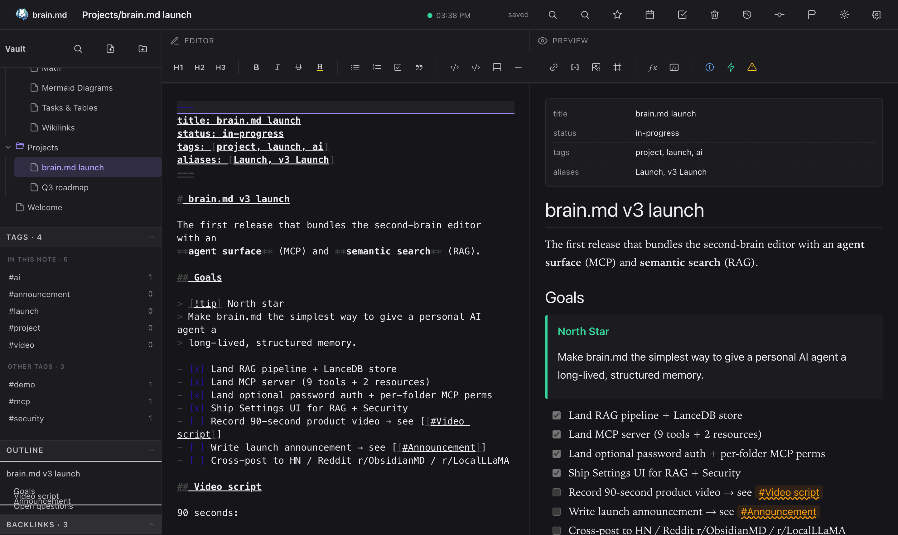

The right rail collects **Bookmarks · Vault · Tags · Outline ·
Backlinks · Related**. Each section is collapsible and remembers its
state per device (`localStorage`). The **Tags** panel splits into
*In this note* and *Other tags* the moment you open a note. The
**Related** panel powers itself from the RAG index — same engine the
agents use — and after every save brain.md quietly suggests up to three
tags borrowed from your closest semantic neighbours.

### Markdown that actually does things

#### Callouts

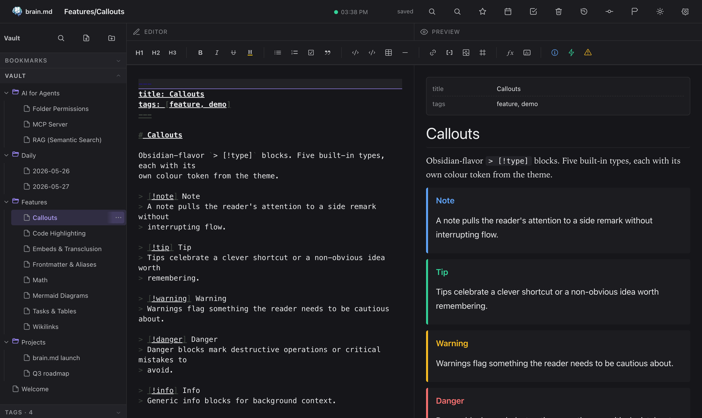

#### Math (KaTeX)

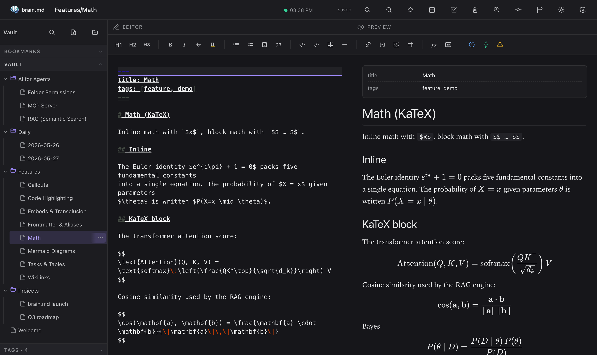

#### Mermaid diagrams

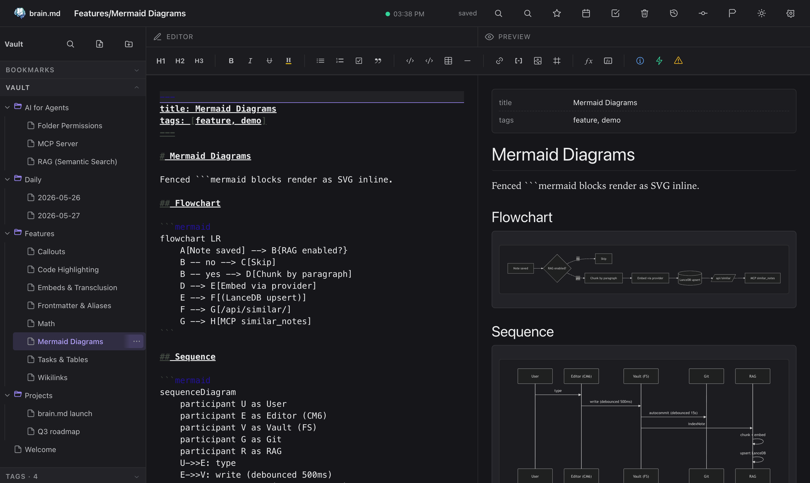

#### Syntax-highlighted code

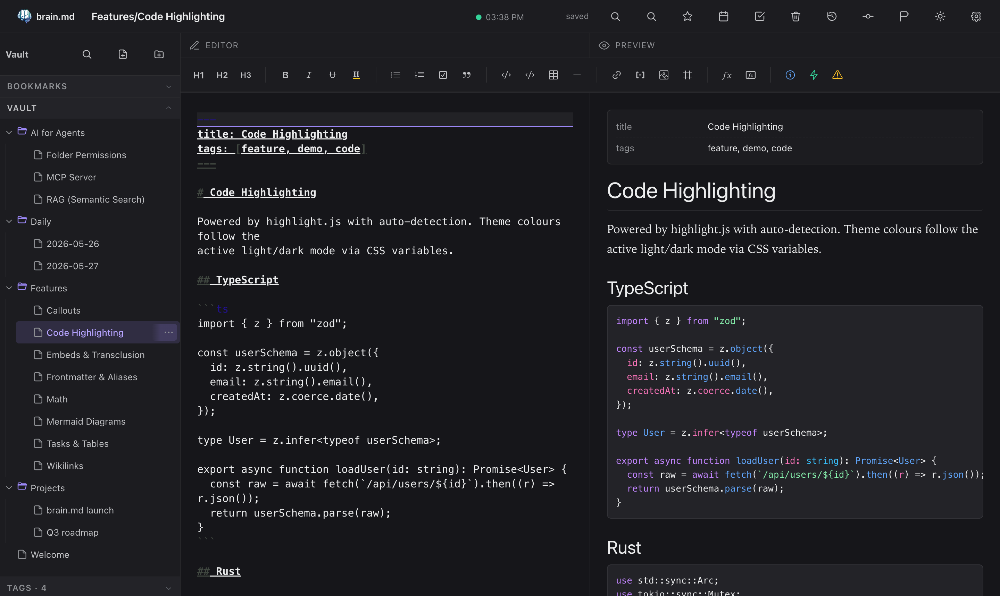

### Command palette + quick switcher

- **⌘P / Ctrl+P** — search across titles and bodies
- **⌘O / Ctrl+O** — fuzzy quick switcher

Both are powered by [cmdk](https://cmdk.paco.me) inside a Radix Dialog.

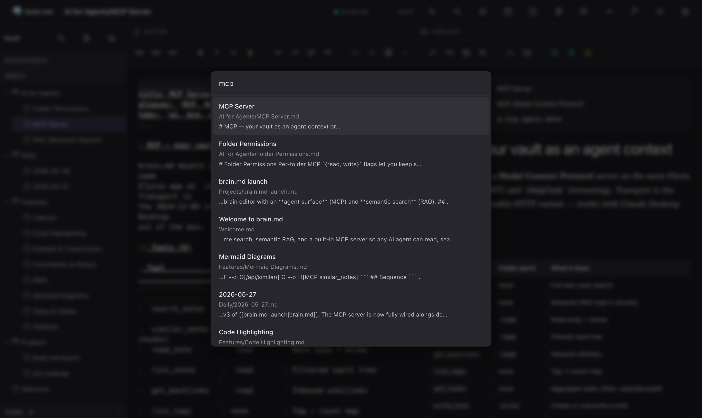

### Tasks across the vault

Every `- [ ]` and `- [x]` in your notes is collected into a single
view, with filters for open / done / all and a click-through to the
source line.

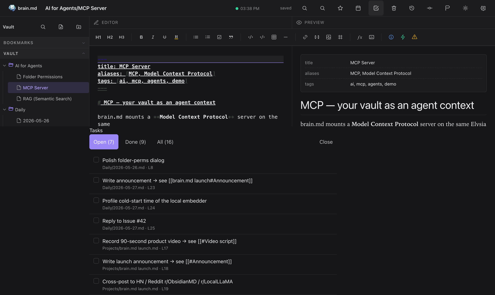

### 📜 Auto versioning & history

Every save is auto-committed to git in the background (debounced,
~15 s). Open any note's **History** panel to see every prior
revision, side-by-side unified diffs, and a one-click **Restore
this version**. Filter by the current note or by the whole vault.
No "save as", no daily snapshots cron — the vault is a real git
repo on disk, so `git log`, `git blame`, `git diff` all work from
the terminal too.

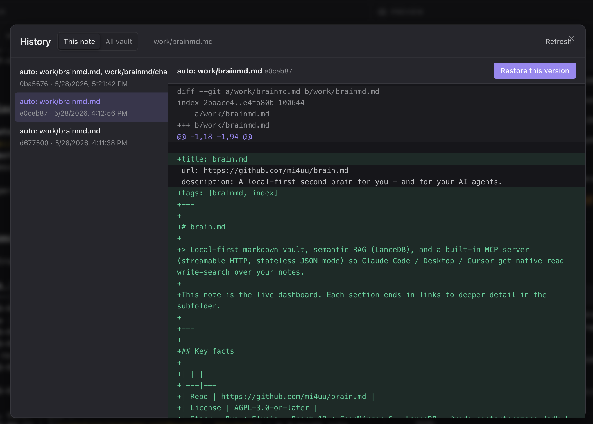

### 📱 Mobile

brain.md is not a desktop-only tool. The same vault, the same
self-hosted instance, the same editor — usable from your phone over
LAN, Tailscale, or a **Cloudflare Tunnel** (Zero Trust, no public
port, no DDNS). The server itself is tiny — a single Bun binary
that runs comfortably on the free tier of **Oracle Cloud** or
**AWS** (ARM micro instances, ≤1 vCPU / ≤1 GB RAM). Drop the binary
on a $0/month VPS, route a hostname to it through Cloudflare, and
you have a private second brain reachable from any device, anywhere.

The mobile layout adapts: editor and preview swap in place via a
bottom tab, the topbar scrolls horizontally with a sticky brand +
hamburger, the sidebar slides in as a drawer.

<p align="center">
  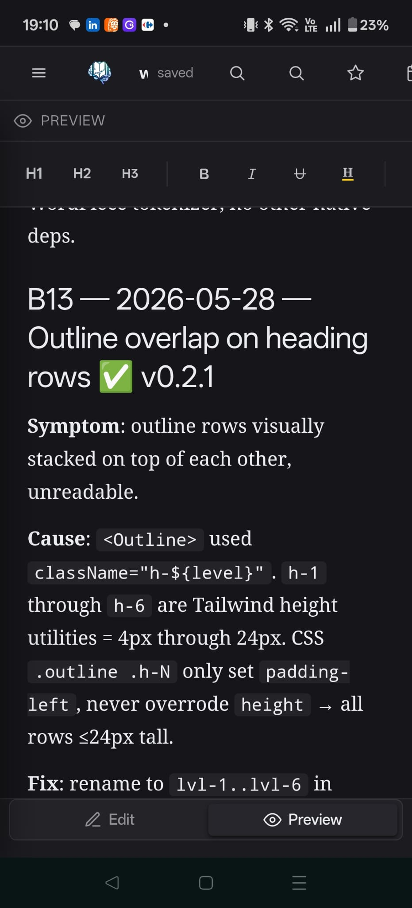
  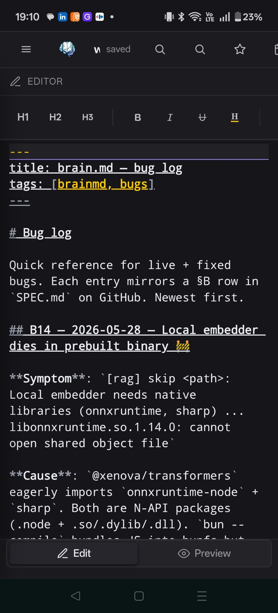
  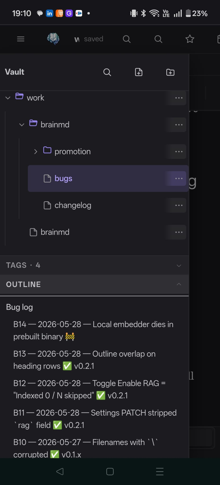
</p>

Real phone, not a Chrome DevTools emulator. Captures notes on the
move; the same RAG, tags, backlinks, and tasks you have on desktop.

---

## 🤖 AI for agents

This is what makes brain.md more than another markdown editor.

### 🔍 Semantic search (RAG)

When a note is saved, brain.md chunks it (≤ 512 tokens, ~64-token
overlap, paragraph-aligned, frontmatter excluded), embeds each chunk,
and upserts the vectors into a per-vault embedded store at
`<VAULT>/.brain/vectors.json` (pure JS, brute-force cosine — well
under 10ms for typical vaults).

| Provider                | Model                                       | dim   | Local? | API key |
|-------------------------|---------------------------------------------|------:|:------:|:-------:|
| Local *(default)*       | `bge-small-en-v1.5` (WASM)                  |   384 |   ✓    |   —     |
| Ollama                  | e.g. `nomic-embed-text`                     |   768 |   ✓    |   —     |
| LM Studio               | any served GGUF embedder                    | varies|   ✓    |   —     |
| OpenRouter *(free tier)*| `nvidia/llama-nemotron-embed-vl-1b-v2:free` |  2048 |   —    |   ✓     |
| OpenAI                  | `text-embedding-3-small`                    |  1536 |   —    |   ✓     |

> **Out of the box, in the prebuilt binary.** The local embedder ships
> as bundled WASM ONNX with a hand-rolled BERT tokenizer — no
> `onnxruntime-node`, no `sharp`, no platform-specific `.node`
> bindings. Toggle **Enable RAG** in Settings → AI / RAG, brain.md
> fetches the ~34 MB quantized model once and works fully offline
> after that, on macOS / Linux / Windows alike. Want to keep your
> existing Ollama or hosted endpoint? Switch to *OpenAI-compatible*
> in the same panel.

#### OpenRouter — free embeddings, zero local deps

If the WASM model doesn't fit your machine (constrained RAM / no
disk space for the cache) and you don't want to run Ollama either,
**OpenRouter** ships a free OpenAI-compatible embeddings endpoint
that requires no local model, no GPU, no setup beyond an API key.

In **Settings → AI / RAG**:

| Field      | Value                                       |
|------------|---------------------------------------------|
| Provider   | OpenAI-compatible                           |
| Base URL   | `https://openrouter.ai/api/v1/`             |
| Model      | `nvidia/llama-nemotron-embed-vl-1b-v2:free` |
| DIM        | `2048`                                      |
| API Key    | from [openrouter.ai/keys](https://openrouter.ai/keys) — no credit card required for `:free` models |

Click **Test connection**, then **Reindex vault**. Indexes the whole
vault in seconds, multilingual, multimodal-aware (works on notes
mixing languages). Trade-offs: data leaves your machine on every
embed call; free tier has rate limits; works only when online.

> **Heads-up — same applies to Ollama / OpenAI / any HTTP embedder.**
> Switching `Base URL`, `API Key`, or `DIM` while staying on the same
> provider+model takes effect immediately as of v0.3.1 / v0.4.0
> ([B17](https://github.com/mi4uu/brain.md/commit/511cc69)). Older
> binaries needed a server restart for those fields to apply.

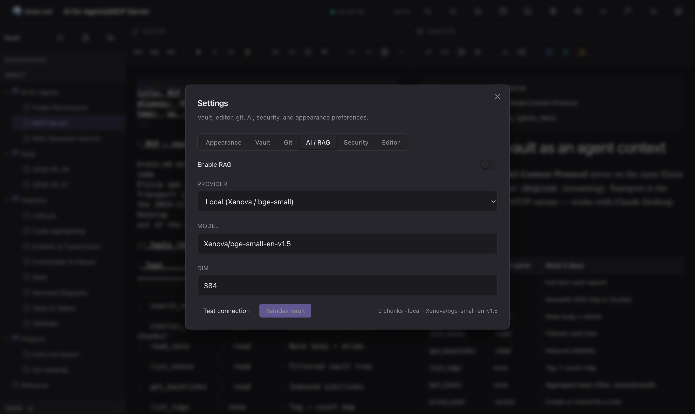

REST surface:

| Method | Path                          | What                                                   |
|--------|-------------------------------|--------------------------------------------------------|
| GET    | `/api/similar?q=…&k=…`        | Top-k semantic hits with snippet + line range          |
| GET    | `/api/related/*path?k=…`      | Notes semantically close to a given path               |
| POST   | `/api/context`                | Pack top chunks into a token-budgeted markdown block   |
| GET    | `/api/orphans?limit=…`        | Notes with no backlinks AND low semantic neighbours    |
| GET    | `/api/digest?since=7d`        | Topic clusters across recently modified notes          |
| GET    | `/api/rag/status`             | Provider, model, dim, chunks, `needsReindex`           |
| POST   | `/api/rag/reindex`            | Walks the vault and rebuilds the index                 |
| POST   | `/api/rag/test`               | Dry-run an embedder config without saving              |

#### Related notes, in the sidebar

The same engine the agents use also powers a **Related** panel in the
sidebar. Open any note → the panel lists semantically close neighbours
with score, line range and a snippet preview. Click jumps you there.

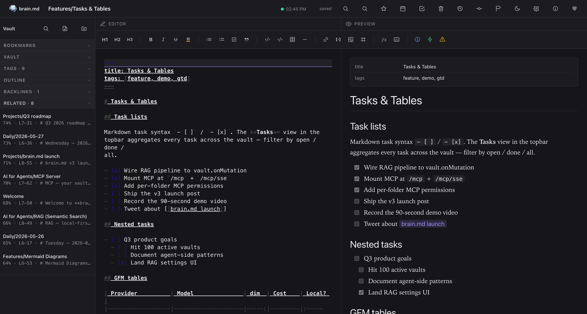

#### Tag suggestions on save

After every save, brain.md quietly looks at the closest neighbours'
frontmatter `tags` and suggests up to three you haven't used yet.
One click drops the tag into your frontmatter.

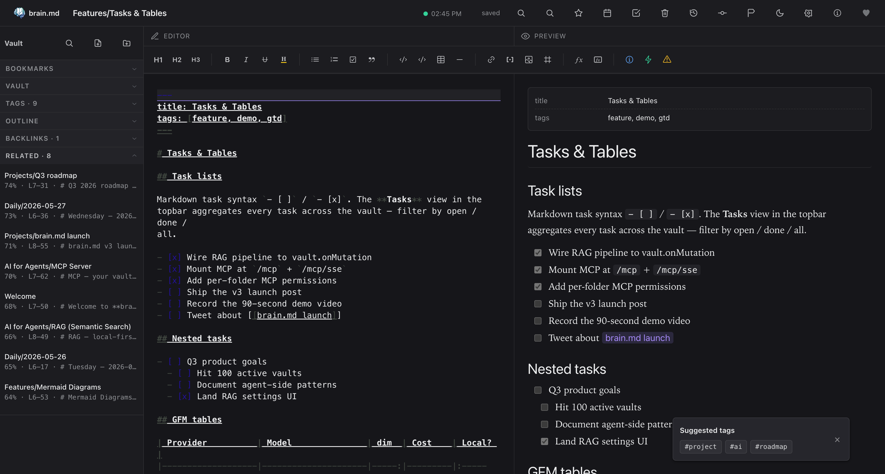

### 🛰️ MCP server

brain.md mounts a **Model Context Protocol** server on the same Elysia
app at `POST /mcp`. Transport is the **2024-11-05 streamable HTTP**
variant in **stateless JSON-response mode** — one POST returns the
full JSON-RPC response in a single round trip, no SSE stream, a fresh
`McpServer` + transport per request. Sounds wasteful, but it's the
only mode that survives clients that open and close a transport per
tool call (Claude Desktop and LM Studio both do this).

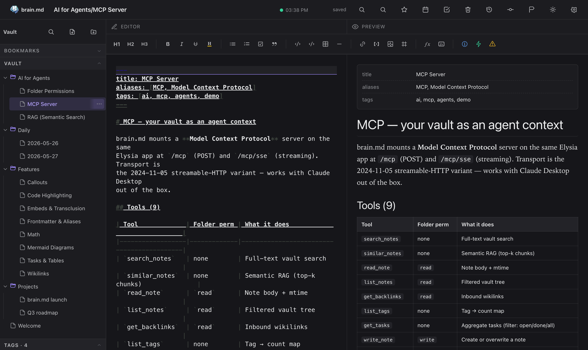

Tools (16):

| Tool                  | Folder perm | What it does                                                       |
|-----------------------|-------------|--------------------------------------------------------------------|
| `search_notes`        | none        | Full-text vault search                                             |
| `similar_notes`       | none        | Semantic RAG (top-k chunks)                                        |
| `read_note`           | `read`      | Note body + mtime                                                  |
| `list_notes`          | `read`      | Filtered vault tree                                                |
| `get_backlinks`       | `read`      | Inbound wikilinks                                                  |
| `list_tags`           | none        | Tag → count map                                                    |
| `get_tasks`           | none        | Aggregate tasks (filter: open/done/all)                            |
| `write_note`          | `write`     | Create or overwrite a note                                         |
| `append_note`         | `write`     | Append a paragraph (blank-line separator)                          |
| `find_related`        | `read`      | Notes semantically close to a given path (excludes self)           |
| `find_similar_tasks`  | `read`      | Semantic search across task lines (filter: open/done/all)          |
| `semantic_outline`    | `read`      | Cluster a note's chunks into topical groups (cosine ≥ threshold)   |
| `context_for_query`   | `read`      | Pack top-relevant chunks into a markdown context block (token cap) |
| `find_orphans`        | `read`      | Notes with 0 backlinks AND low semantic neighbour density          |
| `weekly_digest`       | `read`      | Topic clusters across notes modified in a recent window (e.g. 7d)  |
| `compare_notes`       | `read`      | Cosine sim + unified diff + shared headings between two notes      |

Resources (2):

- `vault://tree` — JSON `{folders, notes}` filtered by read perms
- `vault://note/<path>` — markdown body

Drop this into the MCP config of any client that speaks **streamable
HTTP natively** — Claude Code, Cursor, Continue, Cline, Zed, the
official `@modelcontextprotocol/inspector`, etc.:

```json
{
  "mcpServers": {
    "brain.md": {
      "type": "streamable-http",
      "url": "http://localhost:3000/mcp"
    }
  }
}
```

Restart the client; the tools appear.

#### Claude Desktop — stdio bridge required

The Claude Desktop app (macOS / Windows) only speaks **stdio** —
streamable HTTP and SSE are not supported as of writing. Bridge it
through [`mcp-remote`](https://github.com/geelen/mcp-remote), which
runs as a stdio child of Claude Desktop and forwards every JSON-RPC
call over HTTP to your brain.md server:

```json
{
  "mcpServers": {
    "brain.md": {
      "command": "npx",
      "args": [
        "mcp-remote",
        "http://localhost:3000/mcp"
      ]
    }
  }
}
```

Drop that into `~/Library/Application Support/Claude/claude_desktop_config.json`
(macOS) or the equivalent on your OS, then restart Claude Desktop.

> **Note**: `mcp-remote` upstream warns that Cursor and Claude Desktop
> (Windows) have a bug where spaces inside `args` aren't escaped. Keep
> URL and header values quote-clean, no embedded spaces.

Full reference: [docs/mcp.md](docs/mcp.md).

### 🔒 Per-folder permissions

Right-click any folder → **MCP permissions…** to set explicit
`{read, write}` flags. Resolution walks the parent chain to root;
nearest explicit override wins; default is read + write.

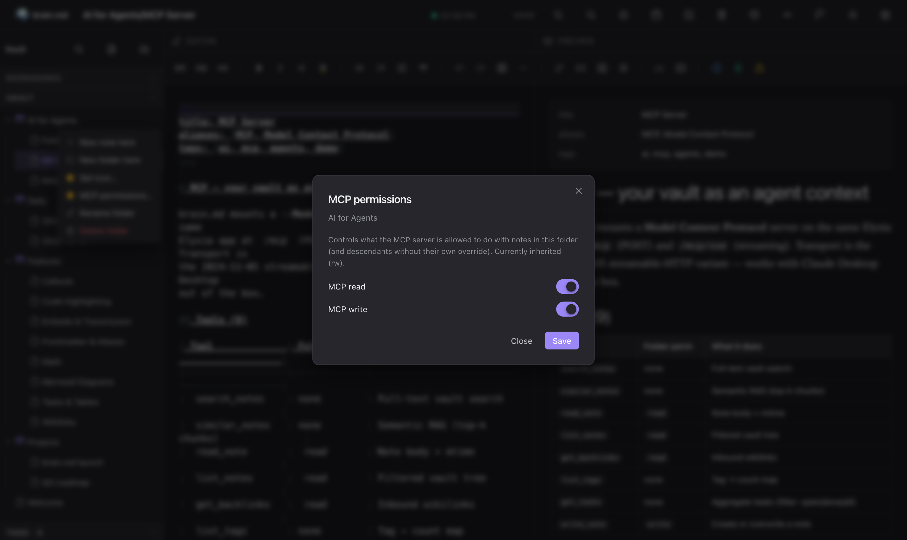

This is how you keep `Journal/Private/` out of agent reach without
locking down the whole vault.

### 🔑 Optional password auth

Default: no auth. Set a password in **Settings → Security** to switch
on bearer-token authentication for *both* the HTTP API and the MCP
endpoints. Password is hashed with **argon2id** (Bun's built-in
`Bun.password`, no native crypto build needed); tokens live in memory
with a 24-hour TTL.

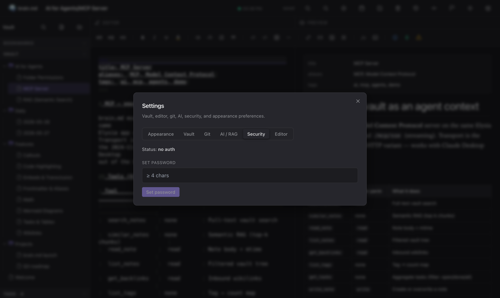

#### MCP config when auth is enabled

The plain-text MCP example earlier in the README assumes no auth.
When you turn auth on, every request to `/mcp` needs an
`Authorization: Bearer <token>` header. Most MCP clients have a
field for it:

**Claude Code / Cursor / Continue / any streamable-HTTP client**:

```json
{
  "mcpServers": {
    "brain.md": {
      "type": "streamable-http",
      "url": "https://brainmd.example.com/mcp",
      "headers": {
        "Authorization": "Bearer YOUR_TOKEN_HERE"
      }
    }
  }
}
```

**Claude Desktop (stdio-only — needs `mcp-remote` bridge)**:

```json
{
  "mcpServers": {
    "brain.md": {
      "command": "npx",
      "args": [
        "mcp-remote",
        "https://brainmd.example.com/mcp",
        "--header",
        "Authorization: Bearer YOUR_TOKEN_HERE"
      ]
    }
  }
}
```

**How to get a token.** brain.md issues tokens through
`POST /api/auth/login`. You can do it from anywhere — most useful
is a quick `curl`:

```sh
curl -X POST https://brainmd.example.com/api/auth/login \
  -H 'content-type: application/json' \
  -d '{"password":"YOUR_PASSWORD"}' | jq -r .token
```

Paste the returned token into the `headers.Authorization` field
above, restart the MCP client, done.

> **Heads-up.** Tokens have a 24-hour TTL and are stored in memory only
> — a server restart invalidates every token. If your agent suddenly
> starts seeing `401 Unauthorized`, get a fresh token. Long-term: pin
> the token on the client and let your agent re-login on 401 (most
> MCP clients don't do this yet — patches welcome).

If you're embedding the URL itself anywhere persistent, prefer a
secret-manager / `.env` over hard-coding the bearer string.

#### OAuth 2.1 for Claude.ai web Custom Connectors (v0.4+)

Static bearer tokens are rejected by Claude.ai's Custom Connector
spec (MCP authorization spec 2025-11-25 forbids `?token=` in the URL
and Claude.ai's UI has no field for a static `Authorization` header).
You need full OAuth 2.1 with PKCE and Dynamic Client Registration.

brain.md ships all of it as of **v0.4.0**. Set a vault password in
Settings → Security (this is what gates the consent screen), then
in the Claude.ai Custom Connector dialog:

| Field | Value |
|---|---|
| Name | `brain.md` (or anything you like) |
| Remote MCP server URL | `https://your-brainmd.example.com/mcp` |
| OAuth Client ID | leave empty — DCR will mint one |
| OAuth Client Secret | leave empty — we use PKCE-only public clients |

Claude.ai will:
1. Hit `GET /.well-known/oauth-protected-resource` and discover the
   embedded authorization server.
2. POST `/oauth/register` to obtain a `client_id` (no human input).
3. Redirect you to `GET /oauth/authorize?...` where brain.md renders
   the consent page. **Type your vault password and click Allow.**
4. Redirect back with `?code=...`, exchange at `/oauth/token` with
   PKCE verifier, get an access token + refresh token.
5. Use the access token for `/mcp` calls. Tokens are audience-bound
   (RFC 8707) — a token issued for brain.md cannot be used elsewhere.

Scopes advertised: `vault:read`, `vault:write`. Per-folder permissions
(set in the web UI) still apply on top — scope grants the surface,
folder-perms grant the path. The narrower of the two always wins.

Same flow works with any spec-compliant MCP client: Cursor, ChatGPT
Apps, future Anthropic clients, etc. Claude Code / Claude Desktop
have shipped before the spec stabilised so they still want a static
bearer or the `mcp-remote` stdio bridge — both documented above.

---

## ⌨️ CLI

```sh
brainmd [options]            # or: bun run start
brainmd --help               # -h
brainmd --version
brainmd --vault-dir <path>   # -v <path>
brainmd --port <n>           # -p <n>
brainmd --mcp-disabled       # skip mounting MCP at /mcp/*
```

Precedence: **CLI flag > env var > XDG default**. Unknown flag →
stderr error + exit 2.

---

## 🗂️ Defaults & paths

| Purpose  | Env var            | Default                                     |
|----------|--------------------|---------------------------------------------|
| Vault    | `XDG_DATA_HOME`    | `$HOME/.local/share/brain.md/vault`         |
| Settings | `XDG_CONFIG_HOME`  | `$HOME/.config/brain.md/`                   |

Same logic on macOS, Linux, Windows — no OS branching. The vault dir
is `mkdir -p`-ed on first run.

Per-vault state lives under `<VAULT>/.brain/`:

```
<VAULT>/
├── Welcome.md
├── Folder/
│   ├── Note.md
│   └── .media/
│       └── img.png
└── .brain/
    ├── index.json          # mtime-based search index
    ├── settings.json       # bookmarks, dailyDir, git autocommit, rag config
    ├── folder-meta.json    # icons, colors, per-folder MCP perms
    ├── auth.json           # argon2id hash — absent when auth is off
    ├── vectors.json        # embedded RAG store (vectors + metadata), git-ignored
    └── trash/<ts>/...      # recoverable deletes
```

Every env knob:

| Var                            | Default | Notes                                     |
|--------------------------------|---------|-------------------------------------------|
| `VAULT_DIR`                    | XDG     | Overridden by `--vault-dir`.              |
| `PORT`                         | `3000`  | Overridden by `--port`.                   |
| `XDG_DATA_HOME`                | —       | Base for default vault location.          |
| `XDG_CONFIG_HOME`              | —       | Base for default settings location.       |
| `GIT_AUTOCOMMIT`               | `1`     | `1` / `0`. Bootstrap default only.        |
| `GIT_AUTOCOMMIT_DEBOUNCE_MS`   | `15000` | Bootstrap default only.                   |

---

## 🏗️ Architecture

```
+----------------+        /api/*        +-------------------+
|  React + CM6   | <------------------> |                   |
|  web client    |                      |                   |
+----------------+                      |   Elysia (Bun)    |  +-------------+
                                        |                   |  | Vault FS    |
+----------------+   /mcp HTTP+SSE      |   - Vault         |  | .brain/     |
| Claude Desktop | <------------------> |   - VaultIndex    |--|   index     |
| (or any MCP    |                      |   - GitRepo       |  |   trash     |
|  client)       |                      |   - SettingsStore |  |   vectors   |
+----------------+                      |   - AuthStore     |  |   auth.json |
                                        |   - MCP server    |  +-------------+
                                        |   - RAG pipeline  |
                                        +-------------------+
                                                  |
                                                  v
                                        +---------------------+
                                        | Embedded RAG store  |
                                        | (pure-JS, JSON)     |
                                        | WASM ONNX / OAI emb.|
                                        +---------------------+
```

- **Runtime**: Bun
- **Backend**: Elysia + native FS + GitRepo (libgit-free shell wrapper
  with an async write mutex)
- **Frontend**: React 18 + CodeMirror 6 + unified/remark/rehype +
  highlight.js + KaTeX + mermaid (lazy) + Radix UI primitives +
  Tailwind tokens (CSS vars under the hood)
- **Vector store**: embedded pure-JS store (JSON-on-disk, brute-force
  cosine) — no native binding, ships in the single binary
- **Embedder**: bundled `onnxruntime-web` (WASM) + hand-rolled BERT
  WordPiece tokenizer — no `onnxruntime-node`, no `sharp`, no Python
- **MCP transport**: `@modelcontextprotocol/sdk`
  `WebStandardStreamableHTTPServerTransport`
- **Auth**: `Bun.password` (argon2id, no native build)

Per-component documentation lives next to the code; see [docs/](docs/)
for the MCP reference.

---

## 🛣️ Roadmap

- Daily-note templates with variable interpolation
- Snippet expansion in the editor (`/` trigger)
- Hybrid search (BM25 + dense), fused via RRF
- Multi-vault support behind a single server
- Encrypted vaults (age key per vault)
- Docker image (multi-arch, < 200 MB compressed)
- Notarised macOS `.app` wrapping the binary
- Hosted read-only demo

Want to nudge one of these up the list? Open an issue or PR.

---

## 💖 Sponsor

brain.md is a solo open-source effort. If it's useful to you and you
can chip in, sponsorship pays for the time that goes into new features,
docs and review.

<p align="center">
  <a href="https://github.com/sponsors/mi4uu">
    
  </a>
</p>

> The `Sponsor ❤` button at the top of this repo and the small heart
> in the brain.md topbar (next to **About**) both lead here.

---

## 🤝 Contributing

Contributions welcome.

1. Open an issue first for anything non-trivial — a quick design
   sketch saves a long PR rewrite.
2. Write the test before the implementation. Server tests run with
   `bun test`; the suite is currently **187 green**.
3. Open a PR. CI runs typecheck (server + web) + `bun test`.

---

## ⭐ Star history

[](https://star-history.com/#mi4uu/brain.md&Date)

Found brain.md useful? A ⭐ helps other people running local-first
agent workflows discover it. No newsletter, no tracking, no
follow-up email — just a signal that this exists.

---

## 📄 License

**GNU Affero General Public License v3.0 or later** — see
[LICENSE](LICENSE).

brain.md is, and will stay, free / libre / open-source. The AGPL was
picked over weaker permissive licenses for two specific reasons:

1. **It closes the SaaS loophole.** If you modify brain.md and run
   it as a network service for others — hosted, multi-tenant,
   rebranded, whatever — you must publish your modified source under
   the same AGPL. Strong copyleft for a server-side tool means the
   community always gets the improvements back.
2. **It can't be relicensed under a permissive license downstream.**
   Forks stay open forever. Nobody can scoop the project, slap a new
   logo on it, and ship a proprietary "Pro" cut.

You're free to:

- run brain.md, personally or commercially, without limits;
- fork, modify, redistribute, even rebrand — provided your fork stays
  under the AGPL and you publish the source you're running.

You're **not** free to:

- ship a closed-source product based on brain.md;
- host a modified brain.md as a public service without publishing
  your modifications under the AGPL.

### Trademarks

The name **brain.md** and the brain.md logo are *not* covered by the
AGPL. If you fork the project, you're welcome to do almost anything
with the code — but please use your own name and your own mark for
your fork so users aren't confused about which project they're
running.

---

<div align="center">

**brain.md** — your notes, your machine, your agents.

Built by **[Michał Lipiński](https://lipinski.work/)**
&nbsp;·&nbsp; [github.com/mi4uu/brain.md](https://github.com/mi4uu/brain.md)
&nbsp;·&nbsp; [report a bug](https://github.com/mi4uu/brain.md/issues/new)

</div>
