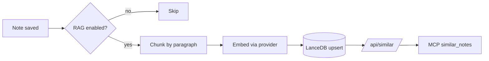
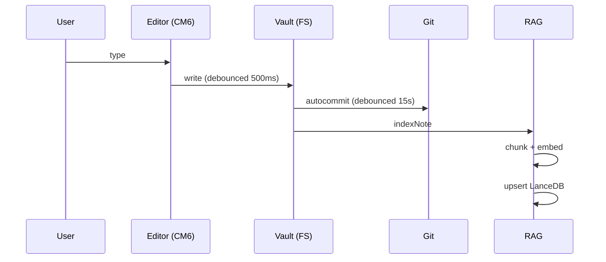
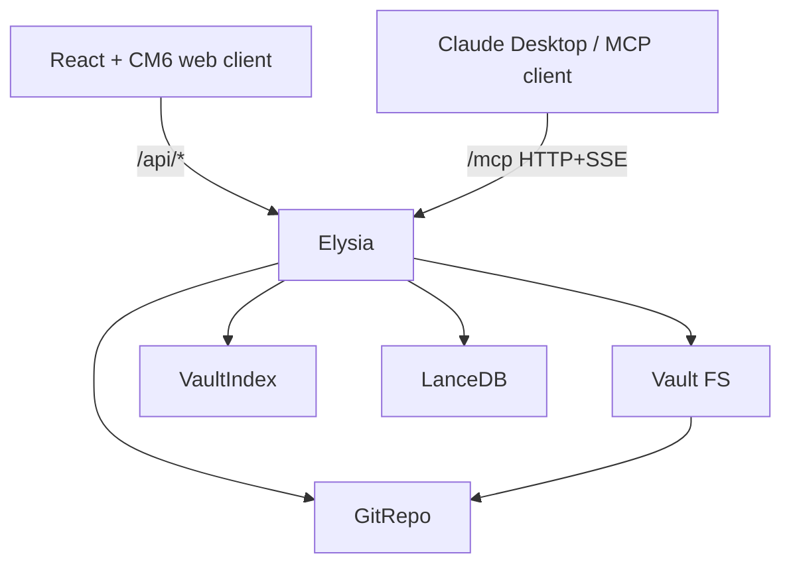

# Mermaid Diagrams

Fenced ```mermaid blocks render as SVG inline.

## Flowchart


```mermaid
flowchart LR
    A[Note saved] --> B{RAG enabled?}
    B -- no --> C[Skip]
    B -- yes --> D[Chunk by paragraph]
    D --> E[Embed via provider]
    E --> F[(LanceDB upsert)]
    F --> G[/api/similar/]
    G --> H[MCP similar_notes]
```

## Sequence


```mermaid
sequenceDiagram
    participant U as User
    participant E as Editor (CM6)
    participant V as Vault (FS)
    participant G as Git
    participant R as RAG
    U->>E: type
    E->>V: write (debounced 500ms)
    V->>G: autocommit (debounced 15s)
    V->>R: indexNote
    R->>R: chunk + embed
    R->>R: upsert LanceDB
```

## Architecture


```mermaid
graph TB
    Client[React + CM6 web client]
    Client -->|/api/*| Elysia
    Agent[Claude Desktop / MCP client]
    Agent -->|/mcp HTTP+SSE| Elysia
    Elysia --> Vault[Vault FS]
    Elysia --> Index[VaultIndex]
    Elysia --> Lance[LanceDB]
    Elysia --> Git[GitRepo]
    Vault --> Git
```
